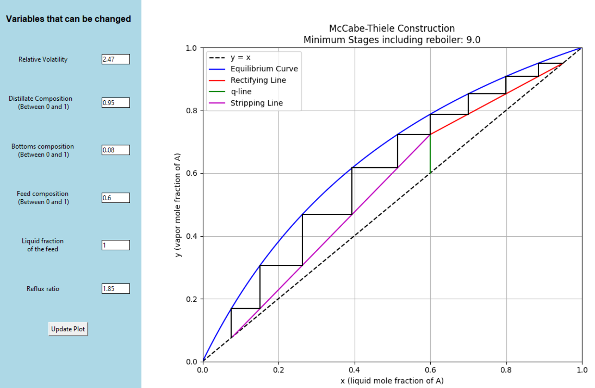

# McCabe - Thiele Distillation Simulator



An interactive Python tool to visualize and simulate binary distillation using the McCabe-Thiele construction.  
This project combines chemical engineering principles with Python (Numpy + Tkinter + Matplotlib) to create an educational and design tool.  

---

# Features
- Interactive GUI elements (Tkinter) for parameter input:
  - Relative volatility 
  - Feed composition 
  - Reflux ratio
  - Feed quality
  - Distillate & bottoms compositions
- Automatic plotting of:
  - Equilibrium curve
  - Operating lines (rectifying, stripping, q-line)
  - Stage-by-stage construction
- Displays minimum number of stages including reboiler.
- Educational tool for learning distillation design.

---

# Installation
Clone this repository and install required packages. Run this in your terminal:

```bash
git clone https://github.com/minangajayasekera-ops/mccabe-thiele-simulator.git
cd mccabe-thiele-simulator
pip install -r requirements.txt

```

**Dependencies**
- Python 3.10+
- NumPy
- Matplotlib
- Tkinter (usually comes with Python)
- Jupyter Notebook

**Usage**
- Launch Jupyter Notebook in your terminal:
```
jupyter notebook
```
- Then open mccabe_thiele.ipynb and run the code.
- When the Tkinter GUI pops up input your values.
- Click "update plot" to see the McCabe-Thiele constrcution with the number of stages.

---

# Future Improvements
- Multi-component distillation
- Overall and Murphree efficiency factors
- Energy balances including reboiler duty


Developed by **Minanga Jayasekera**

First-year Chemical Engineering student @ Imperial College London
